# Interfaz Gráfica en Java

Curso propuesto por el grupo de trabajo Semana de Ingenio y Diseño (**SID**) de la Universidad Distrital Francisco Jose de Caldas.

## Monitor

**Cristian Felipe Patiño Cáceres** - Estudiante de Ingeniería de Sistemas de la Universidad Distrital Francisco Jose de Caldas

# Clase 6

## Objetivos

* Identificar la forma de incorporar componentes gráficos dentro de una Single-page app para que sean vistos desde la ventana principal.
* Comprender el concepto de enrutamiento y como se gestiona la visibilidad de los diferentes componentes dentro de la vista principal.
* Identificar la comunicación entre componentes para el paso de acciones e información.
* Reconocer la importancia del control de la creación desmesurada de objetos en memoria y como controlar este problema.

# Antes de comenzar

Para continuar con el ejercicio deberá actualizar la carpeta **resources/img** ya que se han agregado nuevas imágenes. Estas las puede descargar en este mismo repositorio entrando a la carpeta **Clase6** seguido de **resources/img**. Puede notar que adentro existe una nueva carpeta llamada perfiles, esta también deberá ser agregada ya que tendrá utilidad en futuras clases.  
<div align='center'>
    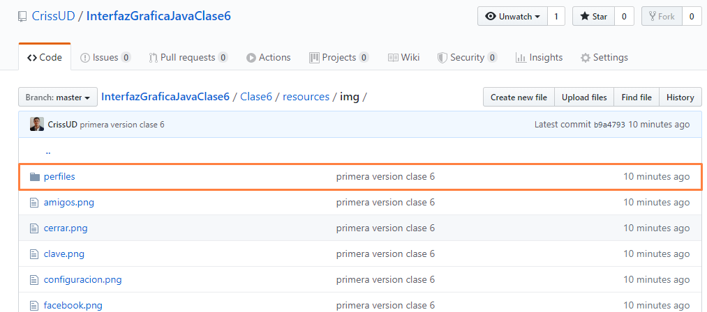
    <p>Carpeta perfiles dentro de resources/img en el repositorio</p>
</div>

Para nuevas fuentes se utilizo la fuente **luzSanz-Book** pero esta no se encuentra por defecto en Windows, dentro del repositorio encontrara un archivo llamado **LUZRO.TTF**, este archivo lo puede descargar e instalarlo en el paquete de fuentes del sistema entrando al **Panel de control / Funetes** y copiando el archivo allí. Si este proceso no se realiza el programa funcionara con normalidad sin embargo los objetos gráficos que usen esta fuente tendrán la fuente por defecto de Java.

<div align='center'>
    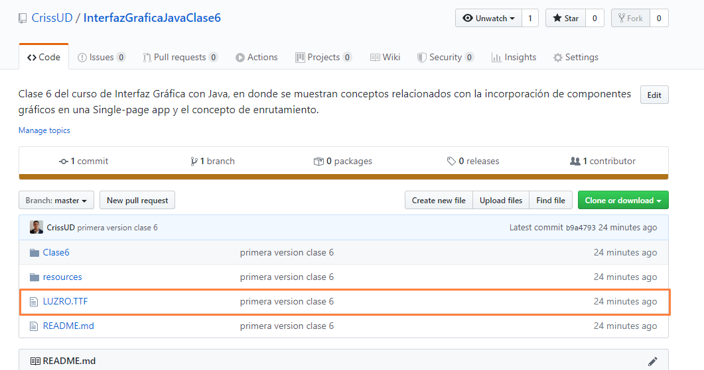
    <p>Archivo de fuente nueva dentro de repositorio</p>
</div>

En el servicio **RecursosService** creamos dos nuevos objetos decoradores **Font**:

**Declaración:**
```javascript
private Font fontBotones, fontPequeña;
```

**Ejemplificación:**
```javascript
fontBotones = new Font("LuzSans-Book", Font.PLAIN, 15);
fontPequeña = new Font("LuzSans-Book", Font.PLAIN, 13);
```

**Métodos get:**
```javascript
public Font getFontBotones(){
    return fontBotones;
}

public Font getFontPequeña(){
    return fontPequeña;
}
```

El objeto decorador **fontTitulo** cambio un poco:
```javascript
fontTitulo = new Font("LuzSans-Book", Font.BOLD, 17);
```

Con lo anterior ya se tendrá todo listo para continuar.

Recordando nuestro recorrido, el componente gráfico **login** esta listo y funcional, tiene una vista agradable para los usuarios, un código modularizado y optimizado, y realiza eventos por acción permitiendo entre otras cosas cerrar la aplicación, mostrar la información recibida del usuario o abrir la ventana principal.

<div align="center">
  
  <p>Login de usuario en funcionamiento</p>
</div>

Nuestra ventana principal ya quedo lista para empezar a construir la Single-Page App a traves de componentes gráficos.

<div align="center">
  
  <p>Vista Principal lista para construirse</p>
</div>

# Componentes Gráficos dentro de un Single-Page App y enrutamiento.

En esta clase veremos tres items importantes relacionados con la creación, gestión y enrutamiento de componentes gráficos:
* Construcción e incorporación de componentes gráficos dentro de Single-Page app.
* Enrutamiento y gestión de visibilidad de componentes gráficos.
* Control en la creación de componentes gráficos en memoria.


# Construcción e incorporación de componentes gráficos dentro de Single-Page app.

## Antecedentes
 
Ya verificamos que nuestra ventana principal cuenta con sus respectivos paneles por medio de sus colores, sin embargo ahora que serán reemplazados podemos quitarle el color a los paneles ya que no será necesario. 

<div align="center">
  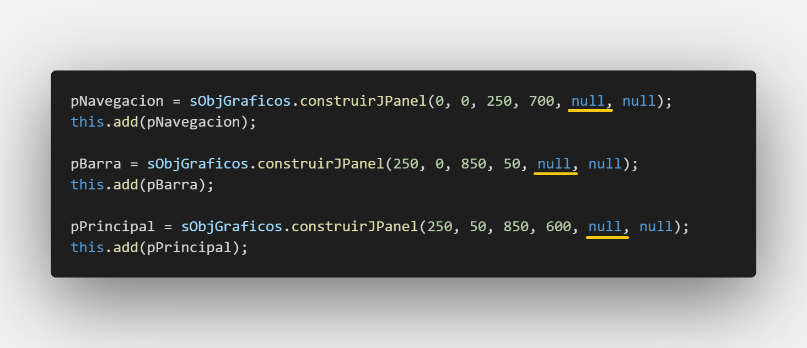
  <p>Paneles de VistaPrincipalTemplate sin color</p>
</div>

Como realmente en la ventana principal no haremos uso de colores ni fuentes ni bordes también se removerá el uso del servicio RecursosService y la importación de la librería Color.

<div align="center">
  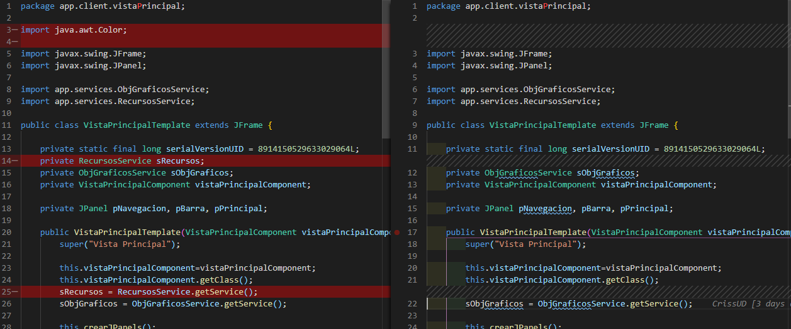
  <p>A la izquierda se ve el código removido y a la izquierda el resultado</p>
</div>

## Creación e incorporación Componente Barra Titulo

Vamos a crear nuestro componente encargado de mostrar la barra de titulo, primero creamos el paquete **barraTitulo** dentro del paquete **Components**, dentro del paquete **barraTitulo** se crearán las clases **barraTituloTemplate** y **BarraTituloComponent**:

<div align="center">
  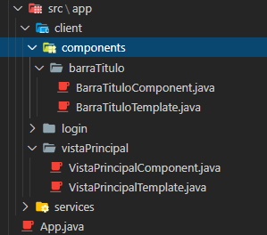
  <p>Creación componente barraTitulo con su respectivo paquete y clases</p>
</div>

Como recordaremos en nuestra clase la clase **Component** generalmente implementa de alguna interfaz que gestiona eventos, no es obligatorio pero en este caso el componente contendrá el botón que cierra la aplicación por lo que sera necesaria la implementación:

**implementación de interfaz**
```javascript
public class BarraTituloComponent implements ActionListener{
}
```
**implementación de métodos de la interfaz**
```javascript
@Override
public void actionPerformed(ActionEvent e) {
}
```

Creamos ahora un atributo de tipo de la clase **Template** y lo ejemplificamos enviándole como argumento una referencia a si misma con la palabra clave **this** para realizar la inyección:

**Declaración**
```javascript
private BarraTituloTemplate barraTituloTemplate;
```

**Ejemplificación**
```javascript
this.barraTituloTemplate=  new BarraTituloTemplate(this); //dentro del constructor
```
Se debe añadir un método **get** de su único atributo, en este caso de **barraTituloTemplate** para que otros componentes puedan acceder a la clase gráfica del componente como explicamos con anterioridad.

```javascript
public BarraTituloTemplate getBarraTituloTemplate() {
    return this.barraTituloTemplate;
}
```

Ahora vamos con la clase **BarraTituloTemplate** esta al tener propiedades gráficas va heredar de un **JPanel**:
```javascript
public class BarraTituloTemplate extends JPanel{
}
```
Como recordamos esta recibe por parámetro dentro del constructor a la clase **Component** para igualarla con un atributo global de la clase, ademas obtendrá los servicios de **ObjGraficosService** y **RecursosService**:

**Declaración**
```javascript
private BarraTituloComponent barraTituloComponent;
private ObjGraficosService sObjGraficos;
private RecursosService sRecursos;
```

**Recibimiento de servicios y clase Component**
```javascript
public BarraTituloTemplate(BarraTituloComponent barraTituloComponent){

        this.barraTituloComponent = barraTituloComponent;
        this.sObjGraficos= ObjGraficosService.getService();
        this.sRecursos = RecursosService.getService();
}
```

Como esta clase hereda de un **JPanel** es necesario darle propiedades gráficas asi que se realizan varias configuraciones:
```javascript
// Dentro del constructor al final
this.setSize(850, 50);
this.setBackground(Color.WHITE);
this.setLayout(null);
this.setVisible(true);
```

Note que el tamaño del panel de esta clase **Template** debe ser exactamente igual que el panel en la **VistaPrincipal** que reemplazara, en este caso va a suplir al panel **pBarra**:

<div align='center'>
    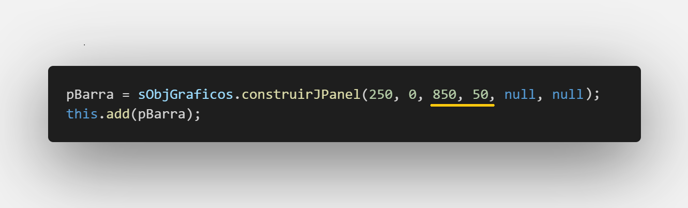
    <p>Mismo tamaño de componente con Panel que reemplazara</p>
</div>

Vamos a agregar 3 objetos gráficos principales, un **Logo**, un **titulo** y un **botón de cerrar**, por lo que realizamos esto como lo veníamos haciendo en nuestras clases anteriores:

**Declaración**
```javascript
//Declaración objetos gráficos
private JLabel lLogoApp, lTituloApp;
private JButton bCerrar;

//Declaración Objetos Decoradores
private ImageIcon iLogoApp, iDimAux;
private Font fontTituloBarra;
```
Se puede observar que vamos a utilizar una fuente que solo se utilizara para el titulo de la interfaz asi que se crea dentro de esta clase y no en **RecursosService**

**Método crearObjetosDecoradores:**

```javascript
public void crearObjetosDecoradores(){
    iLogoApp = new ImageIcon("Clase6/resources/img/logo_app.png");
    fontTituloBarra= new Font("Britannic Bold", Font.PLAIN, 24);
}
```

**Método crearJButtons:**

```javascript
public void crearJButtons(){

    iDimAux = new ImageIcon(
        sRecursos.getICerrar().getImage().getScaledInstance(23, 23, Image.SCALE_AREA_AVERAGING)
    );
    bCerrar = sObjGraficos.construirJButton(
        null, 800, 10, 45, 30, sRecursos.getCMano(), iDimAux, null, 
        null, null, null, "c", false
    );
    bCerrar.addActionListener(barraTituloComponent);
    this.add(bCerrar);
}
```
Como el botón cerrar va a utilizar la misma imagen usada en el login se llama al servicio **RecursosService** para obtener dicha imagen compartida. También se observa que se agrego de una vez la propiedad **addActionListener**.

**Método crearJLabels:**
```javascript
public void crearJLabels(){

    // LABEL LOGO APP--------------------------------------------------------------------
    iDimAux = new ImageIcon(
        iLogoApp.getImage().getScaledInstance(50, 50, Image.SCALE_AREA_AVERAGING)
    );
    lLogoApp = sObjGraficos.construirJLabel(
        null, 20, 0, 50, 50, iDimAux, null, null, null
    );
    this.add(lLogoApp);

    // LABEL TITULO APP--------------------------------------------------------------------
    lTituloApp = sObjGraficos.construirJLabel(
        "ProductList", 40, 5, 200, 40, null, sRecursos.getColorAzul(), null, fontTituloBarra
    );
    this.add(lTituloApp);
}
```
Note que en el label **lTituloApp** se esta usando la fuente exclusiva de esta clase.

**llamada de métodos de creación desde el constructor:**

```javascript
//Dentro del constructor después de obtener servicios 
this.crearObjetosDecoradores();
this.crearJLabels();
this.crearJButtons();
```

Nuestra clase **Template** del componente **barraTitulo** esta lista, para nuestra clase **Component** solo falta añadir un detalle y es la configuración del evento. En este caso sera el de salir de la aplicación que ya lo vimos en la clase anterior:
```javascript
System.exit(0); //dentro del método implementado actionPerformed
```
Note que como en este componente solo existe un botón no es necesario realizar discriminación de acción de ningún tipo.

Nuestro Componente esta totalmente listo, pero falta incorporarlo a nuestra ventana principal:

### **Incorporación de componente en la Single-Page app**

Nos vamos a ubicar en nuestra clase **VistaPrincipalComponent**, allí vamos a declarar un objeto de nuestro componente **barraTitulo** y como se explico en la clase anterior debe hacerse el llamando exclusivamente a la clase **Component**:

**Declaración:**
```javascript
//Declaración componentes
private BarraTituloComponent barraTituloComponent;
```
**Ejemplificación:**
```javascript
//Dentro del constructor
this.barraTituloComponent = new BarraTituloComponent();
```

Ahora viene la parte **más importante** que es la incorporación del componente a la ventana, como queremos que al abrir la ventana este componente ya este incorporado realizaremos el siguiente proceso dentro del constructor:
* Primero debemos obtener el panel que sera reemplazado en este caso **pBarra** y llamaremos entonces al método **get** correspondiente de la clase **VistaPrincipalTemplate**:
```javascript
//Dentro del constructor
vistaPrincipalTemplate.getPBarra();
```

* Una vez obtenemos el panel a remplazar le debemos indicar al panel que vamos a agregar un componente gráfico, para eso llamamos a su método de configuración **add**:
```javascript
//Dentro del constructor
vistaPrincipalTemplate.getPBarra().add();
```

* Debemos especificarle que vamos a incorporar, entonces dentro de los paréntesis llamamos a la clase **Component** que antes hemos ejemplificado:
```javascript
//Dentro del constructor
vistaPrincipalTemplate.getPBarra().add(barraTituloComponent);
```
* Sin embargo la clase **BarraTituloComponent** no cuenta con propiedades gráficas, es la clase **BarraTituloTemplate** la que si las tiene ya que hereda de un **JPanel**, es por eso que el editor muestra un error con el código anterior. Sin embargo si recordamos nuestra clase **BarraTituloComponent** tiene un método **get** que nos devuelve esta clase **Template**, asi que la invocaremos:
```javascript
//Dentro del constructor
vistaPrincipalTemplate.getPBarra().add(
    barraTituloComponent.getBarraTituloTemplate()
);
```
Por cuestiones de espacio horizontal se acomoda la linea de código.

Si corremos nuestra aplicación y abrimos nuestra ventana principal notamos que se ha incorporado exitosamente su primer componente gráfico:
<div align='center'>
    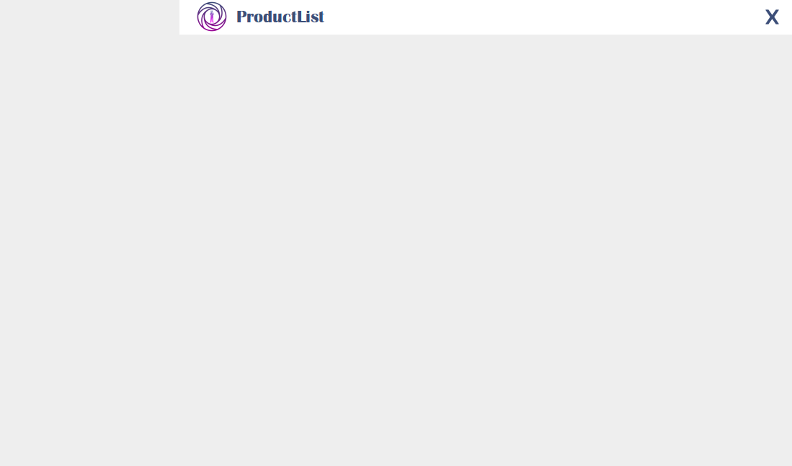
    <p>Vista principal con su primer componente agregado</p>
</div>

Incluso al darle click al botón de cerrar este funcionara de forma adecuada.

## Creación e incorporación Componente Navegación Usuario

Vamos a repetir el mismo proceso para nuestro componente gráfico **navegacionUsuario**  este componente es el encargado de mostrar en pantalla los botones con los que el usuario podrá navegar dentro de la aplicación. Creamos a continuación su paquete dentro del paquete **components** con sus respectivas clases:

<div align='center'>
    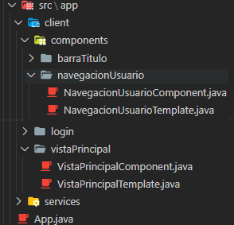
    <p>Creación de componente navegacionUsuario</p>
</div>

Empezamos con la clase **Component** como el componente tendrá botones vamos a necesitar la implementación de la interfaz **ActionListener** y su método:
```javascript
public class NavegacionUsuarioComponent implements ActionListener {

    @Override
	public void actionPerformed(ActionEvent e) {
    }
}
```

Creamos ahora un atributo de tipo de la clase **Template** y lo ejemplificamos enviándole como argumento a si mismo con la palabra clave **this** para realizar la inyección:

**Declaración**
```javascript
private NavegacionUsuarioTemplate navegacionUsuarioTemplate;
```

**Ejemplificación**
```javascript
this.navegacionUsuarioTemplate =  new NavegacionUsuarioTemplate(this); //dentro del constructor
```

Se debe generar también el método **get** de su clase **Template** correspondiente:

```javascript
public NavegacionUsuarioTemplate getNavegacionUsuarioTemplate() {
    return this.navegacionUsuarioTemplate;
}
```

Ahora en nuestra clase **NavegacionUsuarioTemplate** esta debe heredar igualmente de un **JPanel**:

```javascript
public class NavegacionUsuarioTemplate extends JPanel{
}
```

Se obtienen los servicios y la clase **Component** desde el constructor:

**Declaración de servicios y clase Component**
```javascript
private NavegacionUsuarioComponent navegacionUsuarioComponent;
private ObjGraficosService sObjGraficos;
private RecursosService sRecursos;
```

**Obtención de servicios y objeto de clase Component**
```javascript
public NavegacionUsuarioTemplate(NavegacionUsuarioComponent navegacionUsuarioComponent){
    this.navegacionUsuarioComponent = navegacionUsuarioComponent;
    this.sObjGraficos= ObjGraficosService.getService();
    this.sRecursos = RecursosService.getService();
}
```

Se dan las propiedades gráficas al componente gráfico y se debe prestar atención al tamaño ya que debe ser el mismo al panel en la ventana principal que va a reemplazar, en este caso sustituye al panel **pNavegacion**:
```javascript
// Dentro del constructor
this.setSize(250, 700);
this.setLayout(null);
this.setVisible(true);
```

Este componente va a contener los siguientes objetos gráficos:

* Panel que muestra información del usuario:
    * Label con un icono de usuario.
    * Label con el nombre de un usuario.
    * Label con fotografiá de un usuario.
    * Label con un pequeño eslogan.
* Panel que contiene los botones de navegación:
    * Botones de navegación (serán 6 en total)

**Declaraciones:**
```javascript
//Declaración objetos gráficos
private JPanel pSuperior, pInferior;
private JLabel lNombreUsuario, lEslogan, lImagenUsuario, lIconoUsuario;
private JButton bInicio, bPerfil, bAmigos, bProductos, bConfiguracion, bCerrarSesion;

//Declaración Objetos Decoradores
private ImageIcon iIconoUsuario, iInicio, iPerfil, iAmigos, iProductos, 
iConfiguracion, iCerrarSesion, iImagenUsuario, iDimAux;
```

**Método construirJPanels:**

```javascript
public void crearJPanels(){

    this.pSuperior = sObjGraficos.construirJPanel(
        0, 0, 250, 300, sRecursos.getColorAzul(), null
    );
    this.add(pSuperior);

    this.pInferior = sObjGraficos.construirJPanel(
        0, 300, 250, 400, sRecursos.getColorAzul(), null
    );
    this.add(pInferior);
}
```

**Método crearObjetosDecoradores:**

```javascript
public void crearObjetosDecoradores(){

    this.iIconoUsuario = new ImageIcon("Clase6/resources/img/usuario_navegacion.png");
    this.iInicio = new ImageIcon("Clase6/resources/img/inicio.png");
    this.iPerfil = new ImageIcon("Clase6/resources/img/perfil.png");
    this.iAmigos = new ImageIcon("Clase6/resources/img/amigos.png");
    this.iProductos = new ImageIcon("Clase6/resources/img/productos.png");
    this.iConfiguracion = new ImageIcon("Clase6/resources/img/configuracion.png");
    this.iCerrarSesion = new ImageIcon("Clase6/resources/img/salir.png");
    this.iImagenUsuario = new ImageIcon("Clase6/resources/img/perfiles/perfil1.png");
}
```

**Método crearJLabels:**
```javascript
public void crearJLabels(){

    // LABEL ICONO USUARIO--------------------------------------------------------------------
    iDimAux = new ImageIcon(
        iIconoUsuario.getImage().getScaledInstance(40, 40, Image.SCALE_AREA_AVERAGING)
    );
    this.lIconoUsuario = sObjGraficos.construirJLabel(
        null, 10, 20, 40, 40, iDimAux, null, null, null
    );
    this.pSuperior.add(lIconoUsuario);

    // LABEL NOMBRE USUARIO--------------------------------------------------------------------
    this.lNombreUsuario = sObjGraficos.construirJLabel(
        "Nombre de Usuario", 40, 20, 200, 40, null, Color.WHITE, null, sRecursos.getFontTitulo()
    );
    this.pSuperior.add(lNombreUsuario);

    // LABEL IMAGEN USUARIO--------------------------------------------------------------------
    iDimAux = new ImageIcon(
        iImagenUsuario.getImage().getScaledInstance(180, 180, Image.SCALE_AREA_AVERAGING)
    );
    this.lImagenUsuario = sObjGraficos.construirJLabel(
        null, (this.pSuperior.getWidth()-180)/2, 75, 180, 180, iDimAux, null, null, null
    );
    this.pSuperior.add(lImagenUsuario);

    // LABEL ESLOGAN--------------------------------------------------------------------
    this.lEslogan = sObjGraficos.construirJLabel(
        "<html><div align='center'> Nuestros clientes son <br/>lo mas importante</div></html>",  
        (this.pSuperior.getWidth()-180)/2, 265, 180, 40, 
        null, Color.WHITE, null, sRecursos.getFontPequeña()
    );
    this.pSuperior.add(lEslogan);
}
```

Noten que en el label **lEslogan** hay algo diferente, y es que cuando enviamos un texto estamos enviando unas etiquetas **HTML** esto es debido a que no podemos dar saltos de linea dentro de un label de forma normal, es decir si escribimos **\n** no va a funcionar, es por eso que hacemos uso de etiquetas html para poder dar saltos de linea a nuestro texto y ademas brindar de varias otras características como: 
* **`<html>`** indica que se va a iniciar un formato html y se debe cerrar al final con **`</html>`**.
* **`<div align='center'>`** Le da a nuestro texto propiedad de centrado, la etiqueta **div** debe tener una etiqueta de cerrado **`</div>`**.
* **`<div align='justify'>`** Le da a nuestro texto propiedad de texto justificado, la etiqueta **div** debe tener una etiqueta de cerrado **`</div>`**.
* **`<br/>`** indica un salto de linea, esto es solo cuando queremos dar un salto de linea en una parte en especifico, si no ponemos esta etiqueta de todos modos el html realiza el salto de linea automático una vez ocupa todo el espacio de ancho.

**Método crear JButtons**

```javascript
public void crearJButtons(){

    // BOTÓN INICIO--------------------------------------------------------------------
    iDimAux = new ImageIcon(
        iInicio.getImage().getScaledInstance(20, 20, Image.SCALE_AREA_AVERAGING)
    );
    this.bInicio = sObjGraficos.construirJButton(
        "      Inicio", 30, 30, 200, 40, sRecursos.getCMano(), 
        iDimAux, sRecursos.getFontBotones(), null, Color.WHITE, null, "l", false
    );
    this.bInicio.addActionListener(navegacionUsuarioComponent);
    this.pInferior.add(bInicio);

    // BOTÓN PERFIL--------------------------------------------------------------------
    iDimAux = new ImageIcon(
        iPerfil.getImage().getScaledInstance(20, 20, Image.SCALE_AREA_AVERAGING)
    );
    this.bPerfil = sObjGraficos.construirJButton(
        "      Perfil", 30, 80, 200, 40, sRecursos.getCMano(), 
        iDimAux, sRecursos.getFontBotones(), null, Color.WHITE, null, "l", false
    );
    this.bPerfil.addActionListener(navegacionUsuarioComponent);
    this.pInferior.add(bPerfil);

    // BOTÓN AMIGOS--------------------------------------------------------------------
    iDimAux = new ImageIcon(
        iAmigos.getImage().getScaledInstance(20, 20, Image.SCALE_AREA_AVERAGING)
    );
    this.bAmigos = sObjGraficos.construirJButton(
        "      Amigos", 30, 130, 200, 40, sRecursos.getCMano(), 
        iDimAux, sRecursos.getFontBotones(), null, Color.WHITE, null, "l", false
    );
    this.bAmigos.addActionListener(navegacionUsuarioComponent);
    this.pInferior.add(bAmigos);

    // BOTÓN PRODUCTOS--------------------------------------------------------------------
    iDimAux = new ImageIcon(
        iProductos.getImage().getScaledInstance(20, 20, Image.SCALE_AREA_AVERAGING)
    );
    this.bProductos = sObjGraficos.construirJButton(
        "      Productos", 30, 180, 200, 40, sRecursos.getCMano(), 
        iDimAux, sRecursos.getFontBotones(), null, Color.WHITE, null, "l", false
    );
    this.bProductos.addActionListener(navegacionUsuarioComponent);
    this.pInferior.add(bProductos);

    // BOTÓN CONFIGURACIÓN--------------------------------------------------------------------
    iDimAux = new ImageIcon(
        iConfiguracion.getImage().getScaledInstance(20, 20, Image.SCALE_AREA_AVERAGING)
    );
    this.bConfiguracion = sObjGraficos.construirJButton(
        "      Configuraciones", 30, 230, 200, 40, sRecursos.getCMano(), 
        iDimAux, sRecursos.getFontBotones(), null, Color.WHITE, null, "l", false
    );
    this.bConfiguracion.addActionListener(navegacionUsuarioComponent);
    this.pInferior.add(bConfiguracion);

    // BOTÓN CERRAR SESIÓN--------------------------------------------------------------------
    iDimAux = new ImageIcon(
        iCerrarSesion.getImage().getScaledInstance(20, 20, Image.SCALE_AREA_AVERAGING)
    );
    this.bCerrarSesion = sObjGraficos.construirJButton(
        "      Cerrar Sesión", 30, 280, 200, 40, sRecursos.getCMano(), 
        iDimAux, sRecursos.getFontBotones(), null, Color.WHITE, null, "l", false
    );
    this.bCerrarSesion.addActionListener(navegacionUsuarioComponent);
    this.pInferior.add(bCerrarSesion);
}
```

Estos botones tienen unas características peculiares:
* Todos cuentan con una imagen y ademas un texto, esto es posible y nuestro servicio **ObjGraficosService** esta configurado para estos casos.
* Para que exista una separación visible entre el icono y el texto, este ultimo empieza con unos espacios de la forma:
<div align='center'>
    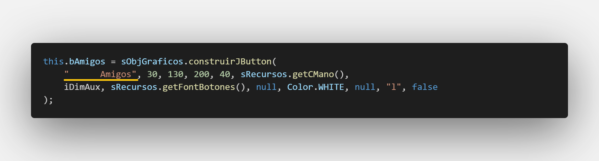
    <p>Separación de texto con icono dentro del botón</p>
</div>

* El botón esta vez cuenta con una dirección hacia la izquierda por lo que se envía como argumento **"l"** para el parámetro **dirección**.
* No tienen fondo por lo que se envía como argumento un **false** para el parámetro **esSolido**.

**llamada de métodos de creación desde el constructor:**
```javascript
//Dentro del constructor después de obtener servicios 
this.crearObjetosDecoradores();
this.crearJPanels();
this.crearJLabels();
this.crearJButtons();
```

Nuestro componente gráfico esta casi listo solo falta realizar la configuración de los eventos de acción pero esto se discutirá en la siguiente sección **Enrutamiento y gestión de visibilidad de componentes gráficos**. Por el momento vamos a incorporarlo en la vista principal.

### **Incorporación de componente en la Single-Page app**

Nos vamos a ubicar nuevamente en nuestra clase **VistaPrincipalComponent**, allí vamos a declarar un objeto de nuestro componente **navegacionUsuario** y como se explico en la clase anterior debe hacerse el llamando exclusivamente a la clase **Component**.

**Declaración:**
```javascript
//Declaración componentes
private NavegacionUsuarioComponent navegacionUsuarioComponent;
```
**Ejemplificación:**
```javascript
//Dentro del constructor
this.navegacionUsuarioComponent = new NavegacionUsuarioComponent();
```

La incorporación la vamos a realizar de la misma manera que explicamos con el anterior componente gráfico, esta vez vamos a reemplazar el panel **pNavegacion**:
```javascript
//Dentro del constructor
vistaPrincipalTemplate.getPNavegacion().add(
    navegacionUsuarioComponent.getNavegacionUsuarioTemplate()
);
```

Si corremos nuestra aplicación y abrimos nuestra ventana principal notamos que se ha incorporado exitosamente el segundo componente:
<div align='center'>
    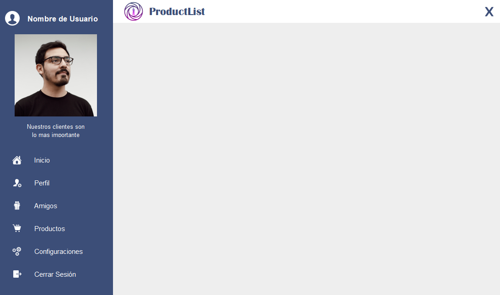
    <p>Vista principal con el componente Navegación usuario agregado</p>
</div>

Sin embargo al dar click sobre cualquiera de los botónes, estos no hacen nada aun, esto se discutirá en la siguiente sección.

# Enrutamiento y gestión de visibilidad de componentes gráficos.

Ya tenemos nuestros dos componentes incorporados a la ventana principal, esto nos da una ventaja enorme ya que cada componente tiene su propia responsabilidad y su código sera mucho mas entendible. Lo que queremos hacer ahora es que cuando se oprima cualquiera de los botones del componente **navegacionUsuario** la ventana principal gestionara que componentes se verán dentro del panel **pPrincipal** este proceso se conoce como **enrutamiento** que para paginas web tiene mas sentido ya que esta gestión de visibilidad de componentes se hace mediante rutas en el navegador, sin embargo para introducirnos al proceso se decidió dejar el mismo nombre, al final es el mismo resultado lo que queremos hacer.

La clase que se debe encargar de gestionar que es visible y que no dentro de la misma es solamente la clase **VistaPrincipalComponent**, se podría pensar que el componente **navegacionUsuario** al tener los botones se debería encargar de esta labor pero es erróneo, es la misma ventana principal la que debe hacer su propia gestión.

## Creación de componentes Gráficos

Primero vamos a crear los componentes gráficos a los cuales se quiere gestionar su visibilidad en la ventana principal.

<div align='center'>
    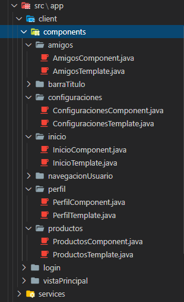
    <p>Creación de componentes para gestionar enrutamiento</p>
</div>

Realizaremos una vez el proceso de creación de uno de estos componentes (**inicio**), los demás tendrán el mismo proceso salvo por un pequeño cambio en cada uno que se explicará más adelante:

Empezamos con su clase **InicioComponent**:

* Como por ahora este componente no va a contar con ningún botón no es necesario que implemente ninguna interfaz aun, si en el futuro cuando se este creando este componente nos damos cuenta que tiene botónes o necesita eventos realizaremos la implementación, pero por ahora no:
```javascript
public class InicioComponent{
}
```
* Creamos un objeto de la clase **Template** correspondiente y realizamos la inyección:

**Declaración:**
```javascript
private InicioTemplate inicioTemplate;
```
**Ejemplificación:**
```javascript
// Dentro del constructor
this.inicioTemplate=  new InicioTemplate(this);
```

* Creamos el método **get** Correspondiente:
```javascript
public InicioTemplate getInicioTemplate() {
    return this.inicioTemplate;
}
```

Ahora en nuestra clase **InicioTemplate**:
* Al igual que con los otros componentes creados en esta clase esta hereda de un **JPanel**:
```javascript
public class InicioTemplate extends JPanel{
}
```

* Recibimos la inyección como lo hemos explicado previamente:

**Declaración:**
```javascript
private InicioComponent inicioComponent;
```
**Recibimiento de inyección e igualación:**
```javascript
public InicioTemplate(InicioComponent inicioComponent){
    this.inicioComponent = inicioComponent;
}
```
* Ahora damos propiedades gráficas al componente:
```javascript
// Dentro del constructor
this.setSize(850, 600);
this.setBackground(Color.DARK_GRAY);
this.setLayout(null);
this.setVisible(true);
```

Como se ha explicado antes este debe tener exactamente el mismo tamaño que el panel a remplazar, en este caso sera el panel **pPrincipal**.

***Nota:** Para los otros componentes que creamos (amigos, configuraciones, perfil, productos) sera exactamente el mismo proceso con la diferencia del color en el **setBackground** deben ser distintos, esto para diferenciar cada uno de los componentes.*


## Comunicación bidireccional entre componentes

Como lo que queremos es realizar la gestión de visibilidad desde la clase **VistaPrincipalComponent** pero los botones de activación se encuentra en el componente **navegacionUsuario** debemos hacer que exista una comunicación bidireccional entre ambos componentes para lo que realizaremos una **inyección de dependencia entre componentes gráficos**.

* Primero vamos a la clase **NavegacionUsuarioComponent** y vamos a recibir por parámetro un objeto de tipo **VistaPrincipalComponent**:

```javascript
public NavegacionUsuarioComponent(VistaPrincipalComponent vistaPrincipalComponent) {

    ...
```

* Declaramos un objeto (Atributo) de la misma referencia y lo igualamos al objeto recibido para que sea conocido de forma global en la clase:
```javascript
private VistaPrincipalComponent vistaPrincipalComponent;

public NavegacionUsuarioComponent(VistaPrincipalComponent vistaPrincipalComponent) {
    this.vistaPrincipalComponent = vistaPrincipalComponent;

    ...
```

* Ahora en nuestra clase **VistaPrincipalComponent** nos va a salir un error en la linea en la que ejemplificamos a la clase componente **NavegacionUsuarioComponent** ya que este nos exige el envío de un parámetro por constructor de un objeto de tipo **VistaPrincipalComponent**, simplemente entre los paréntesis colocamos un **this** enviándose a si misma como argumento:
```javascript
this.navegacionUsuarioComponent = new NavegacionUsuarioComponent(this);
```
Ya hemos creado nuestra inyección y con esto hay comunicación bidireccional entre clases.

Ahora antes de continuar como nuestra clase **VistaPrincipalComponent** se va a encargar del enrutamiento vamos a crear un método llamado   **mostrarComponente** y recibirá por parámetro un String al cual llamaremos **comando**:

```javascript
public void mostrarComponente(String comando){
}
```

## Configurando eventos en componente NavegaciónUsuario

Aprovechando que todos nuestros botones dentro del componente tienen texto, vamos a tomar su comando (texto del botón) para ser enviado a la clase **VistaPrincipalComponent** y asi gestionar el enrutamiento. De esta forma nos evitamos también la creación de los métodos **get** dentro de la clase **NavegacionUsuarioTemplate**.

Nos posicionamos en la clase **NavegacionUsuarioComponent** y dentro del método implementado vamos a enviar el comando del botón a la vista principal:

```javascript
@Override
public void actionPerformed(ActionEvent e) {
    this.vistaPrincipalComponent.mostrarComponente(e.getActionCommand());
}
```

Del anterior código se pueden notar varias cosas:
* Como la gestión de enrutamiento la haremos desde la vista principal no es necesario realizar una discriminación de acción desde aquí, esto se realizara en la clase **VistaPrincipalComponent**.
* Podemos notar aquí la importancia de declarar un objeto inyectado para igualarlo dentro del constructor, si esto no se hiciera el objeto inyectado solo existiría dentro del constructor y cuando intentemos llamar al método  **mostrarComponente** desde el método **actionPerformed** nos sacaría un error en ejecución ya que para este entorno no existiría el objeto **vistaPrincipalComponent**.
* Recordemos que el método **getAtionCommand()** nos va a retornar el texto que contiene el botón que activo el evento (el que se oprimió) en forma de String asi que puede enviarse sin problema como argumento al método **mostrarComponente**. 

Sin embargo, como vimos anteriormente para hacer la separación del texto con el icono en cada botón el texto iniciaba con unos espaciós, podemos probar esto realizando una muestra por consola asi:
```javascript
@Override
public void actionPerformed(ActionEvent e) {
    System.out.println(e.getActionCommand());
    this.vistaPrincipalComponent.mostrarComponente(e.getActionCommand());
}
```
Cuando ejecutemos nuestro programa y oprimamos cualquier botón del componente **navegacionUsuario** y vemos la consola podemos notar lo siguiente:

<div align='center'>
    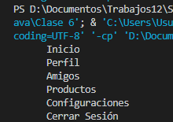
    <p>Texto de cada botón con espacios al inicio</p>
</div>

No queremos enviar estos espacios primero por que no tenemos la certeza de cuantos son y si son los mismos en cada botón, ademas contarlos seria un desperdicio de tiempo.

vamos a hacer uso del método **trim** este método:
* **trim()**: Quita todos los espacios que existan antes y al finalizar un texto dentro de un String.
Nuestra configuración queda asi:

```javascript
@Override
public void actionPerformed(ActionEvent e) {
    System.out.println(e.getActionCommand().trim());
    this.vistaPrincipalComponent.mostrarComponente(e.getActionCommand().trim());
}
```

Una vez ejecutamos la aplicación y vemos en nuestra consola podemos notar lo siguiente:
<div align='center'>
    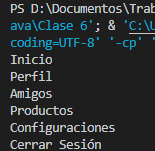
    <p>Texto de cada botón sin espacios al inicio</p>
</div>

Se puede observar que incluso si existe espacio entre el texto este se conserva como es el caso del comando **cerrar Sesión**.

***Nota:** El método para mostrar por consola **(System.out.println)** se hizo como una prueba, asi que se puede retirar.*

## Configuración de Enrutamiento

Ya tenemos casi todo listo para configurar nuestro enrutamiento, ahora nos vamos a posicionar en el método **mostrarComponente** de la clase **VistaPrincipalComponent**.
Una vez recibamos el comando del botón desde el componente **navegacionUsuario** podemos llamar a los demás componentes de acuerdo a la petición del usuario. Esto lo realizaremos con un **switch / case** de la siguiente forma:

```javascript
public void mostrarComponente(String comando){
    switch(comando){
        case "Inicio":
            break;
        case "Perfil":
            break;
        case "Amigos":
            break;
        case "Productos":
            break;
        case "Configuraciones":
            break;
        case "Cerrar Sesión":
            break;
    }
}
```

Note que cada caso dentro del **switch** corresponde al comando de cada botón. Ahora dentro de cada caso vamos a realizar la incorporación de cada uno de los componentes de acuerdo a la petición. Vamos a hacer el ejemplo para el componente **inicio**, sin embargo para el resto de los componentes es igual:

***Nota:** La opción cerrar sesión tendrá un tratamiento diferente y se discutirá de esto en la sección final **Control en la creación de componentes gráficos en memoria** por ahora se dejara vacía.*

* Primero se obtiene el panel que se va a remplazar desde la clase **VistaPrincipalTemplate** con su método **get** correspondiente en este caso llamaremos al panel **pPrincipal**:
```javascript
case "Inicio":
    vistaPrincipalTemplate.getPPrincipal();
    break;
```

* Le indicamos ahora al panel que le vamos a agregar un componente:
```javascript
case "Inicio":
    vistaPrincipalTemplate.getPPrincipal().add();
    break;
```

* Ahora debemos indicarle al panel que componente sera agregado, para esto podemos realizar una **ejemplificación anonima del componente** en cuestión. Para este caso será el componente gráfico **inicio**, hacemos entonces la ejemplificación de la clase **InicioComponent**:

```javascript
case "Inicio":
    vistaPrincipalTemplate.getPPrincipal().add(new InicioComponent());
    break;
```

* Sin embargo como sabemos la clase **Component** no cuenta con características gráficas por lo que debemos llamar a su clase **Template** correspondiente, lo haremos a traves del método **get** de esta:

```javascript
case "Inicio":
    vistaPrincipalTemplate.getPPrincipal().add(
        new InicioComponent().getInicioTemplate()
    );
    break;
```
Se re acomoda el código para no ocupar mucho espacio horizontal.

Esto se realiza con los demás componentes y en teoría estaría listo, sin embargo si ejecutamos nuestra aplicación y oprimimos los botones notaremos que este no realiza ningún cambio aparente.

**¿Por qué sucede esto?**

Hacen falta un par de configuraciones adicionales:
* Para empezar cada vez que se vuelva a llamar un nuevo componente para ser incorporado en el panel **pPrincipal** es necesario que antes de la incorporación se remueva todo lo que este panel contiene, para que esto sea posible debemos llamar a su método **removeAll()**. Esto debe hacerse justamente antes de que empiece el switch:

```javascript
public void mostrarComponente(String comando){
    vistaPrincipalTemplate.getPPrincipal().removeAll();
    switch(comando){
        ...
        ...
    }
```

* Cada vez que un componente sea agregado en el panel **pPrincipal** se debe actualizar toda la ventana para que esta esta pueda mostrar en la pantalla los cambios ocurridos. Para esto debemos llamar al método **repaint()**. Como este método se realiza una vez se haya incorporado el componente en el panel se debe escribir justo debajo del switch:

```javascript
public void mostrarComponente(String comando){
    vistaPrincipalTemplate.getPPrincipal().removeAll();
    switch(comando){
        ...
        ...
    }
    vistaPrincipalTemplate.repaint();
}
```

Si ejecutamos nuestra aplicación y oprimimos los botones de la navegación nos damos cuenta de que ya reemplaza los componentes en el panel principal:

<div align='center'>
    
    <p>VentanaPrincipal una vez se oprimió el botón Inicio</p>
</div>

<div align='center'>
    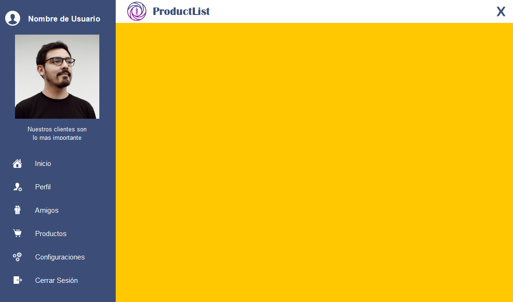
    <p>VentanaPrincipal una vez se oprimió el botón Configuraciones</p>
</div>

# Control en la creación de componentes gráficos en memoria

Cuando oprimamos el botón **Cerrar sesión** queremos que la vista principal deje de ser visible y podamos ver de nuevo el Login. Una opción simple puede ser declarar un objeto de tipo **LoginComponent**  desde la clase **VistaPrincipalComponent**, ejemplificarla y decirle a la clase **VistaPrincipalTemplate** que deje de ser visible:

<div align='center'>
    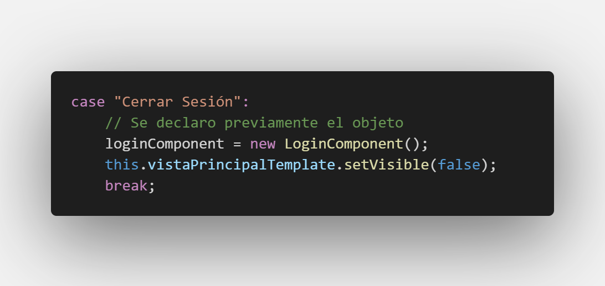
    <p>Posible caso de regreso al Login</p>
</div>

El anterior ejemplo funciona, sin embargo debemos recordar que cuando se inicio la aplicación la clase ejecutora **App** ya creo un objeto en memoria del componente **login**, y si realizamos el proceso anterior descrito estaríamos creando otro objeto en memoria nuevo del componente **login** cada vez que cerramos sesión y el objeto que se creo desde **App** quedaria en el *limbo*.

De hecho si echamos un vistazo a nuestra clase **LoginComponent** en su método **Entrar** notamos que cada vez que se entra a la ventana principal crea un nuevo objeto de esta:

<div align='center'>
    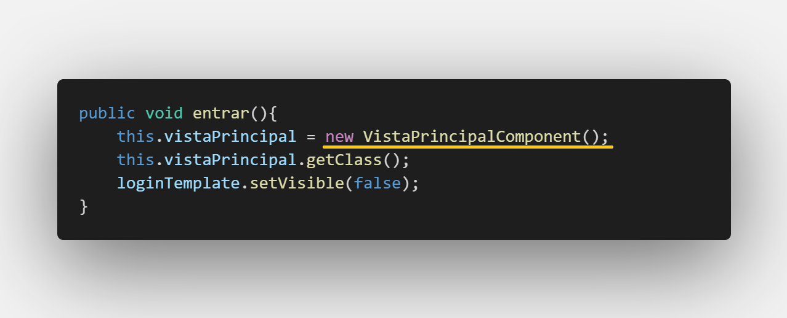
    <p>Creación de un nuevo objeto cada vez que se entra a la aplicación</p>
</div>

Esto es un problema, imaginen que un usuario entra y cierra sesión 10 veces, en memoria se estarían creando 10 objetos tanto del componente  **login** como de **VistaPrincipal**, debemos arreglar esto.

Para empezar vamos a hacer una **inyección de dependencia entre componentes** para estos dos y tener una comunicación bidireccional entre los componentes en cuestión. **Esto no significa que siempre que se quiera controlar la creación de objetos de algún componente se deba realizar inyección de dependencia**, en este caso se hace por que desde el login vamos a gestionar la visibilidad de la ventana principal una vez se inicie sesión y desde la ventana principal vamos a gestionar la visibilidad del login una vez se cierre sesión y para eso necesitamos una comunicación bidireccional. 

Como el programa inicia con el login la inyección se realizara desde la clase **LoginComponent** a la clase **VistaPrincipalComponent**:

* En la clase **LoginComponent**, nos ubicamos en su método **entrar**. Cuando ejemplifiquemos la clase **VistaPrincipalComponent**, le pasamos ahora como argumento el **this** para mandar el objeto de esta clase inyectado:
```javascript
this.vistaPrincipal = new VistaPrincipalComponent(this);
```

* En la clase **VistaPrincipalComponent**, ahora vamos a recibir por parámetro un objeto de la clase **LoginComponent** y lo igualamos a un objeto (atributo) declarado del mismo:

```javascript
private LoginComponent loginComponent;

public VistaPrincipalComponent(LoginComponent loginComponent){
    this.loginComponent = loginComponent;
    ...
}
```

La inyección ya esta hecha y ahora tenemos una comunicación bidireccional entre ambos componentes gráficos, sin embargo aun no hemos evitado la creación de muchos objetos del componente **VistaPrincipal** para esto nos ubicamos ahora en nuestra clase **LoginComponent** en el método **entrar** y realizamos el siguiente cambio:
```javascript
public void entrar(){
    if(vistaPrincipal == null)
        this.vistaPrincipal = new VistaPrincipalComponent(this);
    else
        this.vistaPrincipal.getVistaPrincipalTemplate().setVisible(true);
    loginTemplate.setVisible(false);
}
```

En el anterior codigo estamos haciendo lo siguiente:
* Preguntamos si el objeto de la clase **VistaPrincipalComponent** esta vacío, si aun no se ha entrado a la vista principal este efectivamente estará vacío ya que no se ha ejemplificado antes.
    * Si este esta vacío se ejemplifica enviando como argumento una referencia de la clase **LoginComponent** con un **this** y asi realizar la inyección.
    * Si este ya se ha ejemplificado previamente (por ejemplo se inicio sesión una vez, se cerro la sesión y se volvió a iniciar) entonces vamos a obtener la clase **VistaPrincipalTemplate** mediante el método **get** y le vamos a indicar que sea Visible nuevamente.
* Para ambos casos la visibilidad del Login cambiara para que no se vea en pantalla.

Ya hemos arreglado nuestro problema ahora solo nos queda configurar finalmente nuestra opción de cerrar sesión. Nos ubicamos en el método **mostrarComponente** de la clase **VistaPrincipalComponent** en la opción **Cerrar Sesión** y ponemos:

```javascript
case "Cerrar Sesión":
    this.loginComponent.getLoginTemplate().setVisible(true);
    this.vistaPrincipalTemplate.setVisible(false);
    break;
```

De esta manera hemos controlado la forma de iniciar y cerrar sesión gestionando de forma correcta la creación de objetos en los componentes gráficos.

Ahora si echamos un vistazo a las demás opciónes de enrutamiento vemos nuevamente que cada vez que se oprime cualquier botón que incorpora los componentes gráficos que se muestran en el panel **pPrincipal** se esta creando un objeto nuevo de estos. Esto es el mismo problema que acabamos de tratar. 

<div align='center'>
    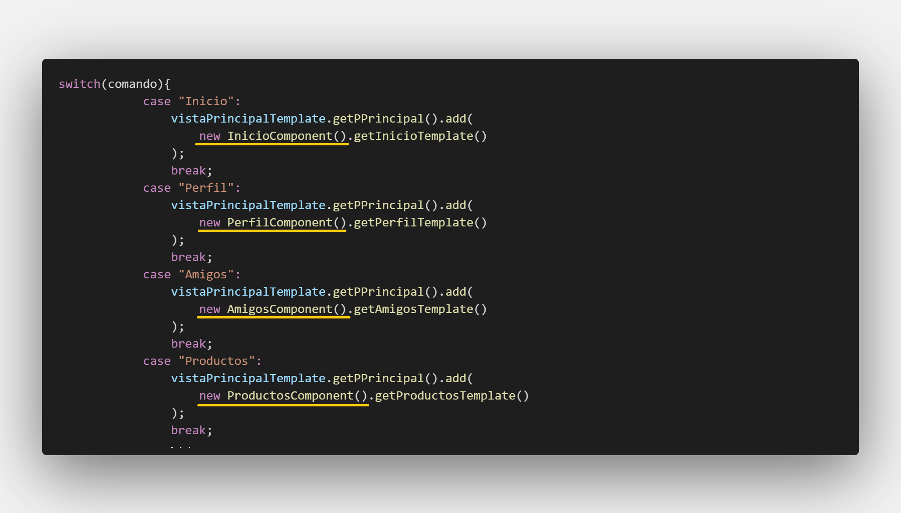
    <p>Problema en creación descontrolada de objetos de los componentes gráficos</p>
</div>

Para corregir esto, una buena alternativa es **declarar** los objetos de los componentes, **ejemplificarlos** en el constructor e **incorporar** ese objeto en las opciones de enrutamiento: 

***Nota:** Se realizara el proceso solo con el componente gráfico **inicio** pero sera igual para los demás componentes*.

**Declaración:**
```javascript
private InicioComponent inicioComponent;
```

**Ejemplificación:**
```javascript
// Dentro del constructor
this.inicioComponent = new InicioComponent();
```

**Incorporación:**
```javascript
// Dentro del método mostrarComponente
case "Inicio":
    vistaPrincipalTemplate.getPPrincipal().add(
        inicioComponent.getInicioTemplate()
    );
    break;
```

Podemos notar que este enfoque funciona y tenemos de forma controlada la creación de sus componentes, sin embargo como todos los componentes gráficos se van a cargar desde el constructor esto le va a restar rendimiento a nuestra aplicación, imaginen que algún usuario ingresa solamente a revisar los productos y nunca oprime el botón de configuración por ejemplo, se habrá cargado todo el componente de configuraciones en vano y gastara memoria y rendimiento.

Una mejor alternativa es la que usamos en la clase **LoginComponent** donde con un if gestionamos la ejemplificación del objeto asi: 

```javascript
case "Inicio":
    if (this.inicioComponent == null)
        this.inicioComponent = new InicioComponent();
    vistaPrincipalTemplate.getPPrincipal().add(
        inicioComponent.getInicioTemplate()
    );
    break;
```
***Nota:** Como se esta ejemplificando ahora desde el método mostrarComponente ahora quitamos la ejemplificación que realizamos en el constructor*.

De esta forma la primera vez que se oprima el botón inicio se creara el objeto en memoria y se incorporara en la ventana principal, pero cuando se vuelva a oprimir simplemente incorporará el objeto que previamente se ejemplifico. Ademas de controlar la cantidad de objetos también lo creamos solamente en caso de ser necesario y de esta forma ganaremos también en el rendimiento de la aplicación.

# Resultado
Si has llegado hasta aquí **!felicitaciones!** has aprendido como incorporar componentes gráficos a la ventana principal para crear un Single-Page App. Aprendiste también como realizar enrutamiento para gestionar la visibilidad de los componentes dentro de la ventana principal. Ademas hemos corregido la creación masiva de objetos de los componentes cuando queremos gestionar su visibilidad.

# Actividad

Realizar la incorporación de componentes gráficos sobre la ventana principal de sus proyectos y realizar enrutamiento de tal forma que se controle la creación de objetos en memoria de los componentes.
